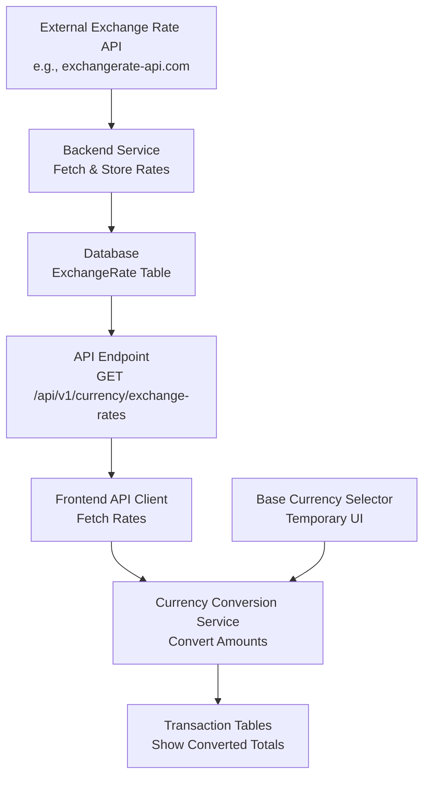

# Currency Conversion System

## Overview

Implement currency conversion to allow users to see unified totals across different currencies. Exchange rates are stored in the backend database, and conversion happens on the frontend. A temporary UI allows selecting a base currency until user settings are added.

## Architecture

## Implementation Steps

### 1. Database Schema - Exchange Rates Table

**File**: `prisma/schema.prisma`Create `ExchangeRate` model:

- `id` - Primary key
- `fromCurrency` - Source currency (e.g., "USD")
- `toCurrency` - Target currency (e.g., "EUR")
- `rate` - Exchange rate (Decimal)
- `date` - Date for historical rates (DateTime, default: today)
- `createdAt` - Timestamp
- `updatedAt` - Timestamp
- Unique constraint on `[fromCurrency, toCurrency, date]`

**Note**: Store rates bidirectionally or calculate inverse on-the-fly (e.g., USD→EUR and EUR→USD)

### 2. API Provider Abstraction Layer

**File**: `src/features/currency/services/providers/exchange-rate-provider.interface.ts`Create interface for exchange rate providers:

- `IExchangeRateProvider` interface with methods:
- `fetchRates(date: Date): Promise<IRateResponse>`
- `getBaseCurrency(): string` - Returns base currency (e.g., "EUR" for ECB)
- `supportsHistorical(): boolean` - Whether provider supports historical data
- `getName(): string` - Provider name for logging

**File**: `src/features/currency/services/providers/ecb.provider.ts`Implement ECB provider:

- Implements `IExchangeRateProvider`
- Fetches EUR-based rates from ECB API
- Parses XML/JSON response
- Returns standardized rate format

**File**: `src/features/currency/services/providers/exchangerate-host.provider.ts`Implement exchangerate.host provider (fallback):

- Implements `IExchangeRateProvider`
- Can be used as fallback if ECB unavailable

**File**: `src/features/currency/services/providers/provider.factory.ts`Factory to get active provider:

- `getProvider(): IExchangeRateProvider`
- Configurable via environment variable: `EXCHANGE_RATE_PROVIDER=ecb|exchangerate-host`
- Defaults to ECB
- Easy to switch providers by changing env var

### 3. Backend Service - Exchange Rate Management

**File**: `src/features/currency/services/exchange-rate.service.ts`Create service with:

- `fetchAndStoreRates(date?)` - Fetch rates from active provider and store in DB (date optional, defaults to today)
- Uses `ProviderFactory.getProvider()` to get active provider
- Fetches base currency rates (e.g., EUR→USD, EUR→GBP from ECB)
- Calculates and stores ALL currency pairs for supported currencies
- For 6 currencies: ~30 pairs (6×5 = all combinations excluding same-currency)
- Stores in database with date
- `getLatestRates()` - Get most recent rates for all currency pairs
- `getRate(fromCurrency, toCurrency, date?)` - Get specific rate with date support
- First checks database for cached rate
- If not found and date is in past, fetches historical rate on-demand
- Calculates cross-rates if needed (e.g., USD→GBP via EUR: USD→EUR * EUR→GBP)
- Falls back to latest rate if historical unavailable
- `getRatesForDateRange(startDate, endDate)` - Batch fetch rates for date range
- Fetches entire range in one call (if provider supports)
- Stores all dates in database
- `updateRates()` - **Daily scheduled job** to refresh current rates
- Runs once per day (e.g., at 1 AM)
- Fetches today's rates for ALL supported currency pairs
- Calculates and stores all ~30 pairs
- **Proactive caching**: Builds historical data automatically over time
- ~1 API call/day regardless of provider

**Daily Proactive Fetching Strategy**:

- **Daily job**: Fetches and stores all currency pairs for today
- **Storage**: ~30 records per day (all pairs for 6 currencies)
- **Benefits**: 
- Recent transactions convert instantly (already cached)
- Historical data builds automatically
- Only need on-demand fetching for very old dates (before daily job started)

**Rate Calculation Strategy**:

- Provider gives base currency rates (e.g., EUR→USD, EUR→GBP from ECB)
- Calculate inverse rates: USD→EUR = 1 / EUR→USD
- Calculate cross-rates: USD→GBP = (USD→EUR) * (EUR→GBP) = (1/EUR→USD) * (EUR→GBP)
- Store all calculated pairs in database for fast lookup
- For 6 currencies: Store all 30 pairs (6×5 combinations)

**Historical Rate Strategy**:

- Store rates by date in database (one record per currency pair per date)
- **Proactive**: Daily job stores today's rates automatically
- **On-demand**: Fetch historical rates only for dates before daily job started
- Cache fetched historical rates in database FOREVER (never expires)
- Use date fallback: if exact date not found, use closest available date
- ECB provides daily rates, so use closest weekday if weekend date requested

**External API Options** (Prioritize free options):

- **ECB (European Central Bank)** (RECOMMENDED) - Completely free, no API key, no rate limits, historical data back to 1999
- Endpoint: `https://api.exchangerate.host/ecb/YYYY-MM-DD` (via exchangerate.host proxy)
- Or direct: `https://www.ecb.europa.eu/stats/eurofxref/eurofxref-hist.xml` (XML, daily rates)
- **Pros**: Free, unlimited, historical data, reliable
- **Cons**: Only provides EUR as base currency (need to calculate cross-rates)
- **exchangerate.host** (Fallback) - Free tier: 100 requests/month, supports historical rates
- Endpoint: `https://api.exchangerate.host/YYYY-MM-DD`
- Use only when ECB doesn't have the rate needed
- exchangerate-api.com (free tier: 1,500 requests/month, **NO historical data** on free plan)
- fixer.io (free tier: 100 requests/month, historical back to 1999)

**Strategy**: Use ECB as primary (free, unlimited), fallback to exchangerate.host only when needed (100/month limit)

### 3. Backend API Endpoints

**File**: `src/features/currency/api/handlers/exchange-rates.ts`Create endpoints:

- `GET /api/v1/currency/exchange-rates` - Get exchange rates
- Query params: 
    - `?date=2024-01-15` (optional, for historical rates - fetches on-demand if not cached)
    - `?fromCurrency=USD&toCurrency=EUR` (optional, filter specific pairs)
- Returns: `{ rates: [{ fromCurrency, toCurrency, rate, date }] }`
- **Smart behavior**: 
    - If date provided and not in DB, fetches from API and stores
    - Returns cached rates if available
    - Falls back to latest rates if historical unavailable

**File**: `src/features/currency/api/handlers/exchange-rates.refresh.ts`

- `POST /api/v1/currency/exchange-rates/refresh` - Manually trigger rate refresh
- Query params: `?date=2024-01-15` (optional, defaults to today)
- Fetches from external API and updates database
- Useful for refreshing current rates or fetching specific historical dates

### 4. Validation Schemas

**File**: `src/features/shared/validation/schemas.ts`Add schemas:

- `ExchangeRateSchema` - Zod schema for exchange rate
- `ExchangeRatesResponseSchema` - Response schema for rates endpoint
- `RefreshRatesResponseSchema` - Response schema for refresh endpoint

### 5. Frontend API Client

**File**: `src/features/currency/api/client.ts`Create client functions:

- `getExchangeRates(date?)` - Fetch exchange rates
- `refreshExchangeRates()` - Trigger rate refresh (if needed)

### 6. Frontend Conversion Service

**File**: `src/features/currency/services/conversion.service.ts`Create conversion utilities:

- `convertAmount(amount, fromCurrency, toCurrency, rates, transactionDate?)` - Convert single amount
- Uses rate for transaction date if provided, otherwise uses latest rate
- `convertTransactions(transactions, toCurrency, rates)` - Convert array of transactions
- Groups transactions by date and fetches rates for each unique date
- Uses appropriate historical rate for each transaction
- `calculateTotal(transactions, toCurrency, rates)` - Calculate unified total
- Handles transactions with different dates using appropriate rates
- `getConversionRate(fromCurrency, toCurrency, rates, date?)` - Get rate for pair (with fallback logic)
- Looks for rate matching transaction date
- Falls back to latest rate if historical rate not available
- Shows warning if using fallback rate

**Conversion Logic**:

- Direct rate: USD → EUR (if exists)
- Inverse rate: EUR → USD (1 / rate)
- Cross-rate: USD → GBP via EUR (USD→EUR * EUR→GBP)
- **Date-aware**: Uses rate from transaction date when available

### 7. React Hook for Exchange Rates

**File**: `src/features/currency/hooks/useExchangeRates.ts`Create hooks:

- `useExchangeRates(date?)` - Fetches exchange rates using React Query
- If date provided, fetches historical rates (on-demand)
- Caches rates by date (staleTime: 24 hours for current, 7 days for historical)
- Refetches current rates daily, historical rates cached longer
- `useExchangeRatesForDates(dates[])` - Batch fetch rates for multiple dates
- Optimizes API calls by fetching unique dates only
- Returns rates object keyed by date
- Returns rates object, loading/error states, and refetch function

### 8. Base Currency Context/State

**File**: `src/features/currency/context/currency-context.tsx`Create context (temporary until user settings):

- `baseCurrency` state (default: "USD" or first currency in list)
- `setBaseCurrency` function
- Provider component
- Persist to localStorage as temporary solution

### 9. Update Transaction Tables

**Files**:

- `src/features/transaction/components/expense/expense-table.tsx`
- `src/features/transaction/components/income/income-table.tsx`

Update totals calculation:

- Extract unique dates from transactions
- Use `useExchangeRatesForDates()` to fetch rates for all transaction dates
- Use `calculateTotal()` from conversion service (passes transaction dates)
- Show both original totals (by currency) and converted total
- Display format: "Total: $1,234.56 (€1,000.00 / £800.00)"
- Show warning indicator if some rates unavailable (using fallback)

### 10. Base Currency Selector Component

**File**: `src/features/currency/components/base-currency-selector.tsx`Create temporary UI component:

- Dropdown to select base currency
- Shows in expense/income overview pages
- Updates context when changed
- Styled to match existing UI components

### 11. Update Overview Pages

**Files**:

- `src/features/transaction/components/expense/expense-overview.tsx`
- `src/features/transaction/components/income/income-overview.tsx`

Add:

- Wrap with `CurrencyProvider`
- Add `BaseCurrencySelector` component in header
- Pass base currency to table components

### 12. Migration and Seed Data

**Migration**: Generate Prisma migration for `ExchangeRate` table**Optional Seed**: Create initial exchange rates (can be fetched via API on first run)

## Files to Create

1. `prisma/schema.prisma` - Add ExchangeRate model
2. `src/features/currency/services/providers/exchange-rate-provider.interface.ts` - Provider interface
3. `src/features/currency/services/providers/ecb.provider.ts` - ECB API provider implementation
4. `src/features/currency/services/providers/exchangerate-host.provider.ts` - exchangerate.host provider (optional fallback)
5. `src/features/currency/services/providers/provider.factory.ts` - Factory to get active provider
6. `src/features/currency/services/exchange-rate.service.ts` - Backend service (uses providers)
7. `src/features/currency/api/handlers/exchange-rates.ts` - GET endpoint
8. `src/features/currency/api/handlers/exchange-rates.refresh.ts` - POST endpoint
9. `src/features/currency/api/client.ts` - Frontend API client
10. `src/features/currency/services/conversion.service.ts` - Conversion logic
11. `src/features/currency/hooks/useExchangeRates.ts` - React hook
12. `src/features/currency/context/currency-context.tsx` - Base currency context
13. `src/features/currency/components/base-currency-selector.tsx` - UI component

## Files to Modify

1. `src/features/shared/validation/schemas.ts` - Add exchange rate schemas
2. `src/features/transaction/components/expense/expense-table.tsx` - Add conversion
3. `src/features/transaction/components/income/income-table.tsx` - Add conversion
4. `src/features/transaction/components/expense/expense-overview.tsx` - Add selector
5. `src/features/transaction/components/income/income-overview.tsx` - Add selector

## Cost Analysis

### With ECB API (Recommended)

- **Monthly API calls**: ~30 calls/month
- Daily proactive fetch: ~30 calls/month (1 per day)
- Historical rate fetches: ~0 calls/month (only for very old dates, then cached)
- **Cost**: $0 (completely free, unlimited)
- **After initial setup**: 
- Daily job builds historical data automatically
- Only need on-demand fetching for dates before daily job started (e.g., 2000)
- Once fetched, those dates are cached forever
- API calls stabilize at ~30/month (daily updates only)

### With exchangerate.host Free Tier (Fallback)

- **Monthly limit**: 100 requests/month
- **Usage**: 
- Daily current rate: ~30 calls/month
- Historical rates: ~70 calls/month remaining
- **Risk**: Could exceed limit if many unique historical dates
- **Cost**: $0 (but limited)

### Recommendation

Use ECB API as primary (free, unlimited). Only use exchangerate.host if ECB unavailable.

### Switching Providers

To switch exchange rate providers:

1. Change environment variable: `EXCHANGE_RATE_PROVIDER=exchangerate-host`
2. Or implement new provider implementing `IExchangeRateProvider`
3. Add to `ProviderFactory`
4. No code changes needed elsewhere - service layer abstracts provider details

**Environment Variable**:

- `EXCHANGE_RATE_PROVIDER` - Options: `ecb` (default), `exchangerate-host`
- Set in `.env` file or environment configuration
- Service automatically uses the configured provider

## Future Enhancements (Not in Scope)

- User settings for default base currency
- Rate change notifications
- Currency conversion in transaction forms (show converted amount)
- Charts/graphs with converted amounts
- Bulk historical rate import (pre-fetch common date ranges)
- Rate accuracy indicators (show if using exact date vs. fallback)

## Considerations

### Historical Transactions (2000+)

- **On-demand fetching**: Historical rates fetched when needed, not pre-loaded
- **Caching**: Once fetched, historical rates stored in DB to avoid repeated API calls
- **Date fallback**: If exact date unavailable, use closest available date (with warning)
- **Batch optimization**: Group transactions by date to minimize API calls

### API Cost Management

- **Free API priority**: Use ECB API (completely free, unlimited, no API key)
- ECB provides EUR-based rates, calculate cross-rates (USD→EUR→GBP)
- Fallback to exchangerate.host only if ECB unavailable (100/month limit)
- **Ultra-aggressive caching**: Store ALL fetched rates in database forever
- **Minimize calls**: 
- Current rates: Fetch once daily (scheduled job) - ~1 call/day
- Historical rates: Fetch on-demand, cache forever - only fetch once per date
- Batch requests: Group by date to reduce API calls
- Check database FIRST before any API call
- **Smart fetching**:
- Fetch entire month/year at once when possible (ECB supports this)
- Pre-fetch common date ranges (e.g., first of each month) to reduce future calls
- **Fallback strategy**: If API fails, show original totals with warning
- **Rate limit monitoring**: Track exchangerate.host usage (if used), stay under 100/month
- **Cost estimate**: With ECB + caching, expect < 50 API calls/month total

### Performance

- **Database caching**: All rates stored in DB to minimize external API calls
- **Frontend caching**: React Query caches rates (24h current, 7d historical)
- **Lazy loading**: Only fetch historical rates when converting old transactions
- **Batch operations**: Fetch rates for multiple dates in single request when possible

### Error Handling

- **Graceful degradation**: If conversion fails, show original totals
- **User feedback**: Show warning when using fallback rates or approximate dates
- **API failures**: Retry logic with exponential backoff
- **Missing rates**: Use latest available rate with visual indicator

### Precision

- **Decimal types**: Use Decimal for rates to avoid floating-point errors
- **Rounding**: Round converted amounts to 2 decimal places for display