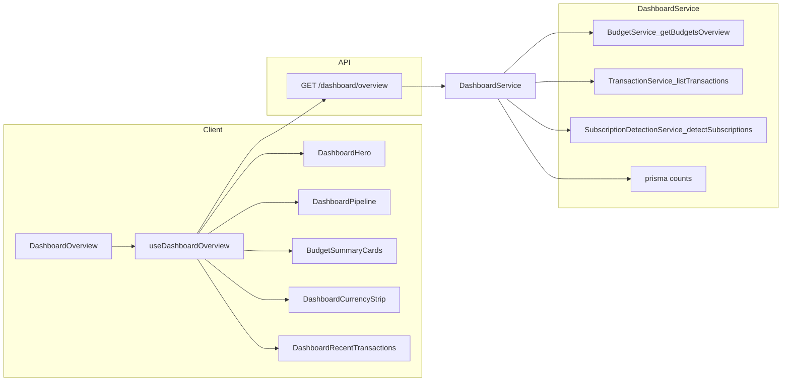

# Dashboard v1: Transaction-to-Budget Command Center

## Goal

Replace the current dashboard ([`dashboard-overview.tsx`](src/features/dashboard/components/dashboard-overview.tsx)), which only renders [`BudgetSummaryCards`](src/features/budget/components/overview/budget-summary-cards.tsx), with a layout aligned to Financely's core loop: **gather transactions → assign to budget → check health**.

**In scope (v1 full):**

- Hero: budget remaining, days left, active budget count
- Pipeline: untagged transactions, new this week, subscription candidates
- Existing 3 budget summary cards (reused)
- Per-currency strip when workspace has multiple currencies in active budgets
- Recent transactions (last 5)
- Period label in header

**Out of scope (deferred):**

- Currency conversion / combined cross-currency totals ([conversion plan](.cursor/plans/currency_conversion_system_bfd454e6.plan.md) not built yet)
- Group split balances (schema placeholder only)
- MoM deltas, projected overshoot, budget-item-at-risk drill-down (phase 2)

---

## Architecture



**Key decision:** one unified endpoint instead of 4+ parallel client queries. [`useBudgetsOverview`](src/features/budget/hooks/useBudgets.ts) is only used by the dashboard today, so the dashboard switches to `useDashboardOverview` and keeps [`budgets.overview`](src/features/budget/api/handlers/budgets.overview.ts) for backward compatibility.

---

## 1. API schema

Add [`src/features/dashboard/validation/schemas.ts`](src/features/dashboard/validation/schemas.ts):

```ts
DashboardOverviewResponseSchema = {
  period: { label, from, to, daysRemaining },
  displayCurrency,           // workspace default currency
  hero: {
    remaining, totalExpected, totalActual, percentage,
    activeCount, currency, spendingPace
  },
  pipeline: {
    untaggedCount,
    newThisWeekCount,
    subscriptionCandidateCount,
  },
  budgetSummary: BudgetsOverviewResponseSchema,  // reuse existing shape
  cashFlow: {                    // within active budget window, display currency only
    income, expenses, net, currency
  },
  byCurrency: [{                 // only currencies with active budgets
    currency, spent, budgeted, remaining, activeBudgetCount
  }],
  recentTransactions: TransactionSchema[],  // max 5
  groupBalance: null,            // reserved for future splits
}
```

Re-export types from [`src/features/shared/validation/schemas.ts`](src/features/shared/validation/schemas.ts) following the existing pattern.

---

## 2. Backend service

Add [`src/features/dashboard/services/dashboard.service.ts`](src/features/dashboard/services/dashboard.service.ts) with `getDashboardOverview(userId, workspaceId)`:

| Section                               | Implementation                                                                                                                                                                                                                                                                                 |
| ------------------------------------- | ---------------------------------------------------------------------------------------------------------------------------------------------------------------------------------------------------------------------------------------------------------------------------------------------- |
| `budgetSummary` + `hero`              | Delegate to existing [`BudgetService.getBudgetsOverview`](src/features/budget/services/budget.service.ts); map `overallHealth` + `timeContext` into `hero`                                                                                                                                     |
| `period`                              | Derive from earliest active budget start / end (same logic as budget overview)                                                                                                                                                                                                                 |
| `displayCurrency`                     | [`resolveDefaultCurrencyFromSetting`](src/features/workspace/utils/resolve-default-currency.ts) via workspace settings                                                                                                                                                                         |
| `pipeline.untaggedCount`              | `prisma.transaction.count` where `primaryTagId IS NULL` and `transactionDate` falls within any active budget window                                                                                                                                                                            |
| `pipeline.newThisWeekCount`           | `prisma.transaction.count` where `createdAt >= startOfWeek`                                                                                                                                                                                                                                    |
| `pipeline.subscriptionCandidateCount` | `SubscriptionDetectionService.detectSubscriptions(...).length` — reuse existing service from [`subscription-detection.service.ts`](src/features/subscription/services/subscription-detection.service.ts). If perf becomes an issue on large workspaces, optimize later with a count-only query |
| `cashFlow`                            | Sum `INCOME` / `EXPENSE` transactions in active budget date range for `displayCurrency` only                                                                                                                                                                                                   |
| `byCurrency`                          | For each distinct currency among active budgets, compute spent/budgeted/remaining independently (no conversion). Omit section when only one currency                                                                                                                                           |
| `recentTransactions`                  | [`TransactionService.listTransactions`](src/features/transaction/services/transaction.service.ts) with `limit: 5`, `sort: transactionDate:desc`                                                                                                                                                |

**Budget accuracy fix (small, in same PR):** In `getBudgetsOverview`, filter transactions to `type: EXPENSE` when computing `totalActual`, tag spend, and percentages. Income should not inflate "spent" metrics. Apply the same filter in per-currency aggregation.

---

## 3. API route

Follow the [`budgets.overview`](src/features/budget/api/handlers/budgets.overview.ts) pattern:

- Handler: [`src/features/dashboard/api/handlers/dashboard.overview.ts`](src/features/dashboard/api/handlers/dashboard.overview.ts)
- Route: [`src/routes/api/v1/$workspaceId/dashboard.overview.ts`](src/routes/api/v1/$workspaceId/dashboard.overview.ts)
- Client: [`src/features/dashboard/api/client.ts`](src/features/dashboard/api/client.ts) → `getDashboardOverview(workspaceId)`

---

## 4. Query layer

In [`src/features/shared/query/keys.ts`](src/features/shared/query/keys.ts):

```ts
dashboardOverview: (workspaceId: number) =>
  ["dashboard", workspaceId, "overview"] as const;
```

Add [`src/features/dashboard/hooks/useDashboard.ts`](src/features/dashboard/hooks/useDashboard.ts) with `useDashboardOverview()` (`staleTime: 30s`, same as budget overview).

**Invalidate** `dashboardOverview` alongside `budgetsOverview` in mutation hooks:

- [`useBudgets.ts`](src/features/budget/hooks/useBudgets.ts)
- [`useTransactions.ts`](src/features/transaction/hooks/useTransactions.ts)
- [`useSubscriptions.ts`](src/features/subscription/hooks/useSubscriptions.ts)
- CSV import completion path

---

## 5. UI components

Refactor [`dashboard-overview.tsx`](src/features/dashboard/components/dashboard-overview.tsx) into sections:

```
Container (title + period subtitle)
DashboardHero
DashboardPipeline          (hidden when all counts are 0)
BudgetSummaryCards         (pass overviewData.budgetSummary)
DashboardCurrencyStrip     (hidden when byCurrency.length <= 1)
DashboardRecentTransactions
```

### New components (all under `src/features/dashboard/components/`)

| Component                           | Behavior                                                                                                                                                                                                                                     |
| ----------------------------------- | -------------------------------------------------------------------------------------------------------------------------------------------------------------------------------------------------------------------------------------------- |
| `dashboard-hero.tsx`                | Large remaining amount via existing [`formatRemaining`](src/features/budget/utils/budget-overview-helpers.ts); subtitle with budgeted total, days left, pace warning; skeleton + error states                                                |
| `dashboard-pipeline.tsx`            | Action rows with counts; each links to filtered destination: untagged → transactions with filter state, new this week → transactions `from` this week, sub candidates → subscriptions page with detect dialog trigger or subscriptions index |
| `dashboard-currency-strip.tsx`      | Compact per-currency rows: spent / budgeted / remaining; footnote: "Amounts shown in native currency (not converted)"                                                                                                                        |
| `dashboard-recent-transactions.tsx` | Compact list reusing patterns from [`transaction-list-grouped.tsx`](src/features/transaction/components/transaction-list-grouped.tsx) (name, amount, primary tag color, date); "View all" → transactions route                               |

### Existing component changes

- [`budget-summary-cards.tsx`](src/features/budget/components/overview/budget-summary-cards.tsx): no logic changes; receives `budgetSummary` prop as today
- Remove generic welcome copy; replace with dynamic period label: `"March 2026 · 12 days remaining"`

### Layout

```text
┌─ Hero ─────────────────────────────────────┐
│  €840 left                                 │
│  of €2,000 budgeted · 12 days left         │
├─ Needs attention (conditional) ────────────┤
│  8 untagged · 24 new this week · 2 subs    │
├─ Budget health (existing 3-col cards) ─────┤
├─ Also tracking (conditional, multi-FX) ────┤
│  USD: $180 left of $500                    │
├─ Recent transactions ──────────────────────┤
│  last 5 items                              │
└────────────────────────────────────────────┘
```

Match existing design tokens: `border-border`, `rounded-2xl`, `bg-surface`, success/warning/danger from [`budget-overview-helpers.ts`](src/features/budget/utils/budget-overview-helpers.ts).

---

## 6. Empty states

| State              | Behavior                                                                                                                                    |
| ------------------ | ------------------------------------------------------------------------------------------------------------------------------------------- |
| No budgets         | Keep existing [`EmptyPage`](src/features/budget/components/overview/budget-summary-cards.tsx) CTA ("Create your first budget") in hero area |
| No transactions    | Pipeline hidden; recent section shows import CTA linking to transactions import                                                             |
| Pipeline all zeros | Hide pipeline section entirely (YNAB/Copilot conditional pattern)                                                                           |
| Single currency    | Hide currency strip                                                                                                                         |

---

## 7. Future-proofing (no UI yet)

- `groupBalance: null` in response schema with typed `DashboardGroupBalanceSchema.nullable()` stub for later split feature
- `Workspace` model unchanged; group workspaces can swap hero/pipeline cards later
- When [currency conversion](.cursor/plans/currency_conversion_system_bfd454e6.plan.md) ships, add optional `convertedTotal` to `byCurrency` / `hero` using workspace default currency — no schema break needed

---

## 8. Testing

- **Service unit tests** ([`src/features/dashboard/services/dashboard.service.test.ts`](src/features/dashboard/services/dashboard.service.test.ts)): pipeline counts, multi-currency breakdown, hero mapping, expense-only budget actuals
- **Handler auth test** following [`budgets.overview`](src/features/budget/api/handlers/budgets.overview.ts) / [`messages.count`](src/features/message/api/handlers/messages.count.ts) patterns
- Manual: workspace with 0 budgets, 1 budget, 2 currencies, untagged transactions, imported txs this week

---

## Phase 2 (not in this PR)

- Cash flow MoM delta labels ("up 12% vs last month")
- Top budget items at risk (from `BudgetComparison.alerts` across active budgets)
- Projected period-end overshoot
- `groupBalance` implementation when split model exists
- FX-converted combined totals
